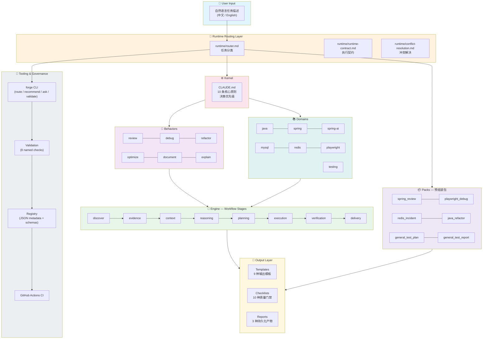
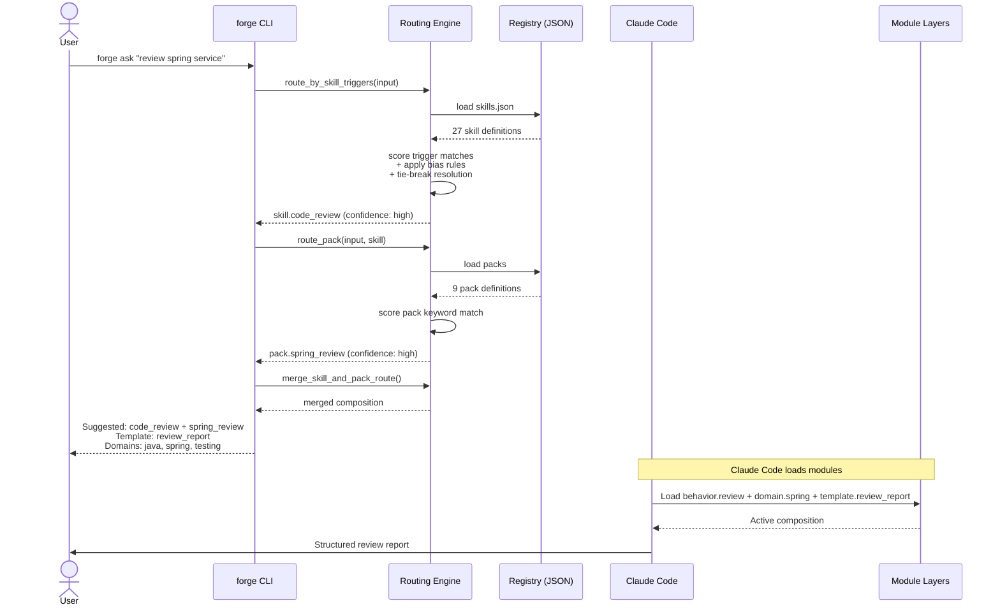

# ARCHITECTURE.md

## Purpose

This repository is a modular operating model for an AI engineering assistant.

Its core design principle is separation of concerns.

The repository is organized so that different types of knowledge and control remain independent, composable, and maintainable.

This document explains:
- the architectural layers
- their responsibilities
- composition rules
- extension rules
- anti-patterns to avoid

---

## Architecture Overview

### Runtime Data Flow

---

## Architectural Model

The system is composed of seven main layers:

1. Kernel
2. Engine
3. Runtime
4. Behaviors
5. Domains
6. Templates
7. Checklists / Reports

These layers are intentionally separate.

---

## Layer Responsibilities

### 1. Kernel
File:
- `CLAUDE.md`

Responsibility:
- define universal operating principles
- define invariants
- define quality posture
- define conflict priority rules

The kernel should not contain:
- task-specific workflows
- domain-specific heuristics
- output-specific formats

Think of the kernel as the system constitution.

---

### 2. Engine
Directory:
- `/engine`

Responsibility:
- define workflow stages only
- define stage purpose, inputs, outputs, and completion criteria

Examples:
- discover
- evidence
- context
- reasoning
- planning
- execution
- verification
- delivery

The engine answers:
- what stage is being executed
- what that stage must produce
- what conditions must hold before moving forward

The engine should not contain:
- task routing logic
- runtime orchestration policy
- examples collections
- integration guidance

Think of the engine as the workflow backbone.

---

### 3. Runtime
Directory:
- `/runtime`

Responsibility:
- route tasks into module compositions
- define runtime execution contract
- define conflict handling between layers
- define orchestration policy

Examples:
- router
- runtime-contract
- conflict-resolution

The runtime answers:
- how a task is assembled
- how workflow stages are selected
- how conflicts are resolved during execution

The runtime should not replace engine stages.
Think of the runtime as the orchestration layer.

---

### 4. Behaviors
Directory:
- `/behaviors`

Responsibility:
- define working mode
- define priorities of attention
- define judgment style
- define what "good work" means for that task type

Examples:
- review
- debug
- refactor
- optimize
- document
- explain

Behaviors answer:
- how to evaluate
- what risks matter most
- what kind of output emphasis is appropriate

Behaviors should not define:
- detailed workflow stages
- domain-specific internals
- template structure

Think of behaviors as thinking modes.

---

### 5. Domains
Directory:
- `/domains`

Responsibility:
- define technical knowledge and domain-specific heuristics
- identify common failure modes
- provide specialized review/debug attention points
- provide verification hints specific to the technology

Examples:
- java
- spring
- spring-ai
- mysql
- redis
- playwright
- testing

Domains answer:
- what technical details matter here
- what failure patterns are common
- what specialized constraints apply

Domains should not define:
- task workflow
- output structure
- universal principles

Think of domains as expertise plugins.

---

### 6. Templates
Directory:
- `/templates`

Responsibility:
- define output shape
- define section ordering
- define artifact structure

Examples:
- review-report
- debug-report
- refactor-plan
- implementation-plan
- explanation

Templates answer:
- what the final output should look like

Templates should not define:
- how to think
- how to reason technically
- what process to follow

Think of templates as presentation contracts.

---

### 7. Checklists and Reports
Directories:
- `/checklists`
- `/reports`

Responsibility:
- checklists define quality gates
- reports define reusable persistent artifact structures

Checklists answer:
- what quality checks must pass before delivery

Reports answer:
- how to store outcomes for future readers

These should not redefine workflow, behavior, or domain logic.

---

## Composition Model

A task should be handled by composing modules from each layer.

Typical flow:
1. load kernel
2. route the task via runtime/router
3. select engine path
4. activate behavior(s)
5. activate domain(s)
6. choose template
7. apply checklist(s)
8. optionally emit report format

Example:
A Spring Redis code review might compose:
- kernel: `CLAUDE.md`
- engine: discover -> evidence -> context -> reasoning -> verification -> delivery
- behavior: review
- domains: java, spring, redis, testing
- template: review-report
- checklists: general-quality, review-checklist, verification-checklist, delivery-checklist

---

## Example Content Policy

Examples are important for adoption, but they are not part of the workflow core.

Examples should live in:
- `EXAMPLES.md`
- integration guides
- onboarding documentation

Examples should not accumulate inside core engine or runtime modules unless a minimal illustrative example is necessary for clarity.

---

## Domain Boundary Policy

Domain files are task-oriented heuristic guides.

They exist to provide:
- specialized technical concerns
- common failure modes
- domain-specific review/debug hints
- verification considerations

They do not exist to become:
- full tutorials
- encyclopedic references
- complete framework or language manuals

A domain file should improve task judgment, not replace official documentation.

---

## Template vs Report Policy

Templates define live response structure.

Reports define persistent artifact structure.

A template is used to shape a response.
A report is used when the result should be stored, handed off, or reused later.

These layers should remain distinct.
Do not create report files that simply duplicate template files without an archival or handoff purpose.

---

## Design Principles

### 1. Single responsibility by file
Each file should have one job.

### 2. Low coupling across layers
A file may reference other layers conceptually, but should not absorb their responsibility.

### 3. High composability
Modules should be reusable across many task types.

### 4. Auditability
Important reasoning should remain traceable.

### 5. Proportionality
The system should support both lightweight and deep tasks without forcing every task into the heaviest path.

### 6. Anti-bloat discipline
Adding files should clarify the system, not fragment it without need.

---

## Extension Model

New files should be added only when they improve reuse and clarity.

### Add a new behavior when
- the new task mode has distinct priorities and judgment style
- existing behaviors cannot represent it cleanly

### Add a new domain when
- a technology has enough unique constraints and failure modes to justify its own module

### Add a new template when
- outputs repeatedly need a distinct shape that existing templates do not cover

### Add a new checklist when
- a recurring quality gate cannot be covered by current checklists without becoming too vague

### Add a new engine file when
- there is a true workflow-level concern not already represented
- not merely a special case of an existing stage

---

## Architectural Anti-Patterns

Avoid:
- putting domain heuristics into behavior files
- putting workflow into templates
- putting formatting rules into domains
- turning the kernel into a dumping ground
- creating many tiny overlapping modules
- adding a module for one rare edge case
- making behavior names too close to domain names
- allowing one "mega file" to absorb multiple layers

---

## Repository Health Signals

Good signs:
- new task types are handled by composition, not kernel expansion
- modules remain understandable in isolation
- outputs remain consistent
- behaviors stay distinct
- domains remain technically focused
- templates remain stable
- checklists remain sharp rather than generic

Bad signs:
- repeated duplication across files
- layers with unclear boundaries
- new files added without composition rationale
- many modules activated by default
- outputs becoming ceremonially large regardless of task size

---

## Path Conventions

The forge system uses two path conventions depending on context:

| Convention | Scope | Example | Resolution |
|------------|-------|---------|------------|
| **Forge-root-relative** | References inside `.forge-skill/forge/` | `behaviors/review.md`, `/runtime/router.md` | Relative to `.forge-skill/forge/` |
| **Tool-root-relative** | References outside the Forge root (e.g., skills) | `.claude/skills/code-review/SKILL.md` | Relative to the active tool directory; `.claude/`, `.codex/`, and `.cursor/` prefixes are stripped during path resolution to avoid double nesting |

In registry JSON files:
- Engine, runtime, behaviors, domains, templates, checklists, reports use forge-root-relative paths (no prefix)
- Skills use `.claude/skills/` prefix because they live outside the forge root

In documentation inside `.forge-skill/forge/`:
- `/` prefix (e.g., `/behaviors/review.md`) means forge-root-relative
- Bare paths (e.g., `behaviors/review.md`) also mean forge-root-relative

In documentation outside `.forge-skill/forge/` (e.g., project-root CLAUDE.md, skills/ SKILL.md files):
- Full `.forge-skill/forge/` or `.claude/skills/` prefixes are required for cross-boundary references

---

## Short Reminder

Architecture means:
- keep layers separate
- compose intentionally
- extend only when reuse justifies it
- resist bloat
